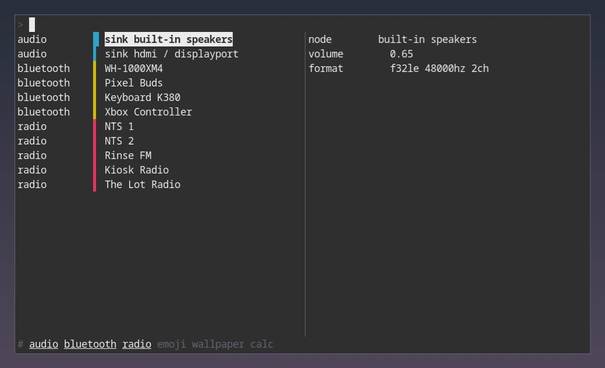

### cmenu

_A script multiplexer_



I had a bunch of dmenu scripts with a keybinding for each one, and I could never remember which key was which.

- A menu is just an executable script which prints lines.
- cmenu runs the scripts, they don't run cmenu.
- One keybinding for all of them - scripts are picked by prefix, `b` for bluetooth, or `on-start` for none at all. Or by name with `#<name>`, or by cycling with <kbd>Shift+Left</kbd> / <kbd>Shift+Right</kbd>.
- Several scripts can be shown at once, in one list, each with its own colour.
- Because cmenu runs them, scripts can be re-run - on an interval, after a selection, or with <kbd>Ctrl+r</kbd>. One script can even trigger another.
- Optional preview pane, filled by the same script - called again with the selected line, printing text or an image.
- Nothing is bundled - write your own, or copy someone else's and change it.

---

### Compared to `script | dmenu`

A script is more than a one-shot pipe:

- It can be re-run while the menu is open, so the lines stay live.
- It can be shown alongside another - the audio menu brings the bluetooth menu with it.
- It gets the selected line back as `$1`, instead of you parsing dmenu's stdout.

---

### Install

Install from source with [Go](https://go.dev/doc/install) and `$ go install go.senan.xyz/cmenu@latest`.

---

### Running it

cmenu is a terminal program, so it's launched in a terminal of its own, and the compositor floats that window. Give the terminal an app ID so it can be matched, then bind it to something nice.

Sway:

```
bindsym Mod4+space exec foot --app-id cmenu cmenu
for_window [app_id="cmenu"] floating enable, resize set 1000 600, border none
```

Hyprland:

```
bind = SUPER, space, exec, foot --app-id cmenu cmenu
windowrule = float, class:cmenu
windowrule = size 1000 600, class:cmenu
```

Other terminals use a different flag for the same thing - `kitty --class cmenu`, `alacritty --class cmenu`, `wezterm start --class cmenu`. On X11 window managers, match on the class instead of the app ID.

It also runs nice in a normal terminal or a tmux pane, which is handy while writing a script.

---

### Configuration

Config lives in `$XDG_CONFIG_HOME/cmenu/config.toml`, and is a list of scripts.

```toml
[[scripts]]
  triggers = ["on-start", "pre b", "script audio", "interval 750ms"]
  name = "bluetooth"
  path = "menu-bluetooth"

[[scripts]]
  triggers = ["pre pw", "pre pass"]
  name = "pass"
  path = "menu-pass"
```

| Key        | Description                                                   |
| ---------- | ------------------------------------------------------------- |
| `triggers` | When to show and load this script, see [triggers](#triggers)  |
| `name`     | Name shown in the gutter, and referenced by `script` triggers |
| `path`     | Path to the script, looked up in `$PATH` if not absolute      |

Config says when to run a script. Everything else, like its colour or hidden columns, is the script's own business, printed with [`cmenu set`](#settings).

#### Triggers

| Trigger          | Description                                               |
| ---------------- | --------------------------------------------------------- |
| `on-start`       | Show when cmenu opens with no prefix typed                |
| `pre <prefix>`   | Show when the input starts with `<prefix>`, e.g. `pre b`  |
| `script <name>`  | Show alongside script `<name>`                            |
| `interval <dur>` | Reload every `<dur>` while visible, e.g. `interval 750ms` |

Running a selection reloads every visible script, if the menu stays open with `stay_open`.

#### Keys

| Key                                                       | Description                 |
| --------------------------------------------------------- | --------------------------- |
| <kbd>Enter</kbd>                                          | Run the selected line       |
| <kbd>Shift+Enter</kbd>                                    | Run it, but keep cmenu open |
| <kbd>Ctrl+r</kbd>                                         | Reload the selected script  |
| <kbd>Up</kbd> / <kbd>Down</kbd>                           | Move                        |
| <kbd>Shift+Up</kbd> / <kbd>Shift+Down</kbd>               | Jump between scripts        |
| <kbd>Shift+Left</kbd> / <kbd>Shift+Right</kbd>            | Cycle which script is shown |
| <kbd>Escape</kbd> / <kbd>Ctrl+c</kbd> / <kbd>Ctrl+d</kbd> | Quit                        |

---

### Writing a script

The whole thing is two calls:

```shell
$ menu-radio          # no args, print the lines
$ menu-radio "<line>" # one arg, act on the selected line
```

That's a working menu. Everything below is extra, and there are [complete examples](#example-scripts) below.

#### Previews

With `preview = true`, the script is called with the selected line again, but with `CMENU_MODE=preview`, and whatever it prints goes in the side pane. `$CMENU_PREVIEW_COLS` and `$CMENU_PREVIEW_LINES` give the size of the pane.

```shell
if [[ "$CMENU_MODE" = "preview" ]]; then
    ...
fi
```

#### Input

Most scripts need no input at all - they just print their lines, and what you type filters them.

But some scripts can't print anything until you've told them what you want - a calculator, a search against a server, a chat assistant. For those, text typed inside `[` `]` is passed to the script as `$CMENU_INPUT`, and re-runs it:

- `c [1+34]` - `c` picks the calculator menu, which is called with `CMENU_INPUT=1+34` and prints the result.
- `m [deepchord] album` - `m` picks the subsonic menu, which searches the server for `deepchord`, and `album` filters those results down to the album lines.

Text outside the brackets filters the lines cmenu already has. Text inside them runs the script again, so give bracket scripts a `debounce` to keep that off every keystroke.

#### Picking a script by name

A script doesn't need a prefix. If the input starts with `#`, the next word is a script `name`, and only that script is shown:

- `#bluetooth` - show the bluetooth script, whatever its triggers are.
- `#radio jazz` - show the radio script, filtered by `jazz`.

<kbd>Shift+Left</kbd> / <kbd>Shift+Right</kbd> cycle through every script in config order, rewriting the input as `#<name>`, so the footer is walkable without remembering any prefix.

#### Markers

Lines are plain text, tab-separated if you want columns, which cmenu pads so they line up. A few markers are available as subcommands, printed as part of a line:

| Command              | Description                                          |
| -------------------- | ---------------------------------------------------- |
| `cmenu highlight`    | Mark this line as current, e.g. the connected device |
| `cmenu label`        | Mark this line as a non-selectable label             |
| `cmenu stay`         | Keep cmenu open after running this line              |
| `cmenu image <path>` | In preview mode, render an image instead of text     |
| `cmenu image -`      | Same, reading the image from stdin                   |

#### Settings

A script says how it wants to be shown by printing `cmenu set` before its lines:

```bash
cmenu set \
    colour 1 \
    preview true \
    hide 1

rbw list --fields id --fields folder --fields name --fields user
```

| Key         | Description                                            |
| ----------- | ------------------------------------------------------ |
| `colour`    | Terminal colour index for this script's rows           |
| `preview`   | Run the script again in preview mode for the cursor    |
| `stay_open` | Keep cmenu open after running a line                   |
| `wrap`      | Wrap long lines instead of cutting them                |
| `hide`      | Columns to keep out of the list, like `1` or `2,5`     |
| `delimiter` | What separates columns, tab by default                 |
| `debounce`  | How long to let typing settle before reloading, e.g. `300ms` |

`hide` and `delimiter` act on the lines after them, the rest on the whole run, last one wins. Print `cmenu set` after any preview or run mode branch so it only reaches the list.

Hidden columns never reach the list or the filter, but stay in the line handed back to your script:

```bash
IFS=$'\t' read -r id _ <<<"$1"
```

Tab is IFS whitespace, so `read` skips empty columns. Keep the columns you read ahead of any that can be empty. Column 1 is the safe spot, and it can pack several values with a separator of your own:

```bash
IFS=: read -r con_id port tab <<<"$id"
```

Free text that might hold tabs of its own wants them squashed, with something like `gsub(/\t/, " ")`, or it draws as columns.

---

### Example scripts

<details>
<summary><code>menu-radio</code> - highlights the playing station, previews it with <code>ffprobe</code></summary>

```bash
#!/usr/bin/env bash

pidfile="$XDG_RUNTIME_DIR/menu-radio.pid"

if [[ "$CMENU_MODE" = "preview" ]]; then
    ffprobe -hide_banner "$RADIO_DIR/$1" 2>&1
    exit 0
fi

[[ -f "$pidfile" ]] && IFS=$'\t' read -r current_pid current_station <"$pidfile"

if [[ "$#" -gt 0 ]]; then
    kill "$current_pid" 2>/dev/null
    [[ "$1" = "$current_station" ]] && exit

    mpv --no-video --quiet "$RADIO_DIR/$1" &
    echo -e "$!\t$1" >"$pidfile"
    exit
fi

highlight="$(cmenu highlight)"

find "$RADIO_DIR" -maxdepth 1 -type f -printf "%f\n" | sort | while read -r station; do
    pre=""
    [[ "$station" = "$current_station" ]] && pre="$highlight"
    printf '%s%s\n' "$pre" "$station"
done
```

</details>

<details>
<summary><code>menu-calc</code> - needs <code>$CMENU_INPUT</code>, has nothing to print without it</summary>

```bash
#!/usr/bin/env bash

if [[ "$#" -gt 0 ]]; then
    wl-copy "$1"
    exit
fi

[[ -z "$CMENU_INPUT" ]] && { echo "$(cmenu label)type an expression in [ ]"; exit; }

result="$(awk "BEGIN { print $CMENU_INPUT }" 2>/dev/null)"
[[ -z "$result" ]] && exit

echo "$result"
```

With `cmenu set debounce 300ms` so it isn't run on every keystroke.

</details>

More examples from the author, to copy and change:

<https://github.com/sentriz/dotfiles/tree/master/conf_desktop/.local/bin/desktop/menus>

---

### FAQ

<details>
<summary>Why a terminal program and not a GUI?</summary>

The terminal already handles fonts, colours, images, and window rules, and scripts already speak stdout.

</details>

<details>
<summary>Is this like Raycast, Alfred, rofi?</summary>

It's similar, but there are no extensions or integrations - cmenu only renders lines from your scripts, and re-runs them.

</details>

<details>
<summary>How do I hide the ID column I use for lookups?</summary>

Print `cmenu set hide` with its column, see [settings](#settings). Your script still gets the full line back in `$1`.

</details>
