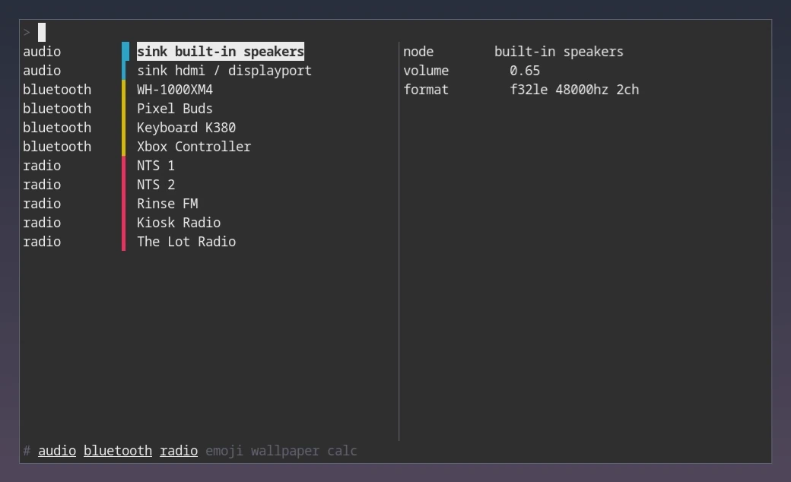

### cmenu

_A script multiplexer_



I had a bunch of dmenu scripts with a keybinding for each one, and I could never remember which key was which.

- A menu is an executable script that prints lines. cmenu runs the scripts, they don't run cmenu.
- One keybinding for all of them. Scripts are picked by prefix, by name, or shown on start.
- Several scripts can share one list, each in its own colour, and one can bring another along.
- Scripts re-run while open - on an interval, after a selection, or with <kbd>Ctrl+r</kbd> - so lines stay live.
- The selected line comes back to the script as `$1`, and the same script can fill a preview pane.
- Nothing is bundled. Write your own, or copy [someone else's](https://github.com/sentriz/dotfiles/tree/master/conf_desktop/.local/bin/desktop/menus).

---

### Install

```
$ go install go.senan.xyz/cmenu@latest
```

cmenu is a terminal program. Launch it in a terminal with an app ID, and float that window:

```
# sway
bindsym Mod4+space exec foot --app-id cmenu cmenu
for_window [app_id="cmenu"] floating enable, resize set 1000 600, border none

# hyprland
bind = SUPER, space, exec, foot --app-id cmenu cmenu
windowrule = float, class:cmenu
windowrule = size 1000 600, class:cmenu
```

Other terminals: `kitty --class cmenu`, `alacritty --class cmenu`, `wezterm start --class cmenu`. On X11, match on the class.

`cmenu open <query>` starts with a query typed, e.g. `cmenu open '#sway'` or `cmenu open 'c [1+34]'`.

---

### Config

`$XDG_CONFIG_HOME/cmenu/config.toml` is a list of scripts:

```toml
[[scripts]]
  triggers = ["on-start", "pre b", "script audio", "interval 750ms"]
  name = "bluetooth"
  path = "menu-bluetooth"
```

| Key        | Description                                                |
| ---------- | ---------------------------------------------------------- |
| `triggers` | When to show and load the script                           |
| `name`     | Shown in the gutter, used by `#<name>` and `script <name>` |
| `path`     | Absolute, or looked up in `$PATH`                          |

| Trigger          | Description                                    |
| ---------------- | ---------------------------------------------- |
| `on-start`       | Show when no prefix is typed                   |
| `pre <prefix>`   | Show when the query starts with `<prefix> `    |
| `script <name>`  | Show alongside script `<name>`                 |
| `interval <dur>` | Reload every `<dur>` while shown, e.g. `750ms` |

Everything else, like colour or hidden columns, is up to the script with [`cmenu set`](#list).

---

### Query

| Query                 | Meaning                                                            |
| --------------------- | ------------------------------------------------------------------ |
| `b `                  | Show scripts with trigger `pre b`                                  |
| `#bluetooth `         | Show the script named `bluetooth`, whatever its triggers           |
| `b jbl`               | Filter the shown lines by `jbl`                                    |
| `m [deepchord] album` | Run the script with input `deepchord`, filter its lines by `album` |
| `m [deepchord`        | An unclosed `[` runs to the end                                    |

Input only reaches scripts picked by prefix or name, not `on-start` or `script <name>` ones. Each change re-runs the script, so set a `debounce`.

---

### Keys

| Key                                            | Description                        |
| ---------------------------------------------- | ---------------------------------- |
| <kbd>Enter</kbd>                               | Run the selected line              |
| <kbd>Shift+Enter</kbd>                         | Run it, and stay open              |
| <kbd>Escape</kbd>                              | [Go back](#going-back), or quit    |
| <kbd>Ctrl+r</kbd>                              | Reload the selected script         |
| <kbd>Up</kbd> / <kbd>Down</kbd>                | Move                               |
| <kbd>Shift+Up</kbd> / <kbd>Shift+Down</kbd>    | Jump between scripts               |
| <kbd>Shift+Left</kbd> / <kbd>Shift+Right</kbd> | Cycle through scripts as `#<name>` |
| <kbd>Ctrl+c</kbd> / <kbd>Ctrl+d</kbd>          | Quit                               |
| Wheel / click                                  | Move / select, click again to run  |

---

### Scripts

A script is called in one of three modes:

| Mode    | Call                                    | Prints           |
| ------- | --------------------------------------- | ---------------- |
| list    | `script`                                | The lines        |
| run     | `script "<line>"`                       | Nothing          |
| preview | `script "<line>"`, `CMENU_MODE=preview` | The preview pane |

| Variable                                      | Description                               |
| --------------------------------------------- | ----------------------------------------- |
| `$CMENU_MODE`                                 | `list`, `run`, or `preview`               |
| `$CMENU_INPUT`                                | Text inside `[ ]`                         |
| `$CMENU_PREVIEW_COLS`, `$CMENU_PREVIEW_LINES` | Size of the preview pane, in preview mode |

The smallest script prints lines, and acts on `$1`:

```bash
#!/usr/bin/env bash

if [[ "$#" -gt 0 ]]; then
    mpv "$RADIO_DIR/$1" &
    exit
fi

ls "$RADIO_DIR"
```

Lines can be split into columns by tabs. cmenu pads them so they line up, except the last, which is free text. Hidden columns stay in `$1`, so column 1 is the place for an ID:

```bash
IFS=$'\t' read -r id _ <<<"$1"
```

`read` skips empty columns, so keep the ones you read ahead of any that can be empty. Squash tabs in free text, e.g. `gsub(/\t/, " ")`.

---

### Commands

Commands print markers that cmenu reads from the lines and the preview.

#### List

`cmenu set <key> <value>...` configures the script. Print it before the lines, after any run or preview branch.

| Key         | Description                                              |
| ----------- | -------------------------------------------------------- |
| `colour`    | Terminal colour index for the script's rows              |
| `preview`   | Call the script in preview mode for the cursor           |
| `stay_open` | Stay open after running a line, and reload               |
| `wrap`      | Wrap long lines instead of cutting them                  |
| `hide`      | Columns to keep out of the list, e.g. `1` or `2,5`       |
| `delimiter` | Column separator, tab by default                         |
| `debounce`  | Wait for typing to settle before reloading, e.g. `300ms` |

`hide` and `delimiter` apply to the lines after them. The rest apply to the whole list, and the last one wins.

#### Line

Printed as part of a line:

| Command               | Description                                                             |
| --------------------- | ----------------------------------------------------------------------- |
| `cmenu highlight`     | Mark the line as current, e.g. the playing song                         |
| `cmenu label`         | Make the line a non-selectable heading                                  |
| `cmenu stay`          | Stay open after running the line                                        |
| `cmenu back`          | [Go back](#going-back) after running the line, with a `<` when selected |
| `cmenu query <query>` | Go to `<query>` instead of running the line, with a `>` when selected   |
| `cmenu input <input>` | Same, replacing what follows the script's prefix                        |

`query` and `input` push the old query, so <kbd>Escape</kbd> returns to it. Drilling down keeps the script stateless, since the level it's on is in `$CMENU_INPUT`:

```bash
printf '%s%s\n' "$(cmenu highlight)" "$station"
printf '%s%s\n' "$(cmenu input "[artist:$id]")" "$name" # list an artist's albums
printf '%s%s\n' "$(cmenu input "[rename:$id ")" rename # leave [ open, to type into the input
printf '%s%s\n' "$(cmenu query "#wifi ")" wifi         # jump to another script
printf '%s%s\n' "$(cmenu back)" "new:$CMENU_INPUT"     # add what was typed, and return to the list
```

#### Preview

| Command              | Description                        |
| -------------------- | ---------------------------------- |
| `cmenu image <path>` | Show an image instead of text      |
| `cmenu image -`      | Same, reading the image from stdin |

---

### Going back

<kbd>Escape</kbd>, and running a `cmenu back` line, step out one level:

1. To the query before the last `cmenu query` or `cmenu input`.
2. Otherwise, to the script's prefix, clearing anything typed after it.
3. Otherwise, <kbd>Escape</kbd> quits, and a `cmenu back` line just runs.

---

### Examples

<details>
<summary><code>menu-radio</code> - highlights the playing station, previews it with <code>ffprobe</code></summary>

```bash
#!/usr/bin/env bash

pidfile="$XDG_RUNTIME_DIR/menu-radio.pid"

if [[ "$CMENU_MODE" = "preview" ]]; then
    ffprobe -hide_banner "$RADIO_DIR/$1" 2>&1
    exit 0
fi

[[ -f "$pidfile" ]] && IFS=$'\t' read -r current_pid current_station <"$pidfile"

if [[ "$#" -gt 0 ]]; then
    kill "$current_pid" 2>/dev/null
    [[ "$1" = "$current_station" ]] && exit

    mpv --no-video --quiet "$RADIO_DIR/$1" >/dev/null &
    echo -e "$!\t$1" >"$pidfile"
    exit
fi

cmenu set preview true

highlight="$(cmenu highlight)"

find "$RADIO_DIR" -maxdepth 1 -type f -printf "%f\n" | sort | while read -r station; do
    pre=""
    [[ "$station" = "$current_station" ]] && pre="$highlight"
    printf '%s%s\n' "$pre" "$station"
done
```

</details>

<details>
<summary><code>menu-calc</code> - needs <code>$CMENU_INPUT</code>, has nothing to print without it</summary>

```bash
#!/usr/bin/env bash

if [[ "$#" -gt 0 ]]; then
    wl-copy "$1"
    exit
fi

cmenu set debounce 300ms

[[ -z "$CMENU_INPUT" ]] && { echo "$(cmenu label)type an expression in [ ]"; exit; }

result="$(awk "BEGIN { print $CMENU_INPUT }" 2>/dev/null)"
[[ -z "$result" ]] && exit

echo "$result"
```

</details>

---

### FAQ

<details>
<summary>Why a terminal program and not a GUI?</summary>

The terminal already handles fonts, colours, images, and window rules, and scripts already speak stdout. It also runs in a normal terminal or tmux pane, which is handy while writing a script.

</details>

<details>
<summary>Is this like Raycast, Alfred, rofi?</summary>

It's similar, but there are no extensions or integrations - cmenu only renders lines from your scripts, and re-runs them.

</details>
